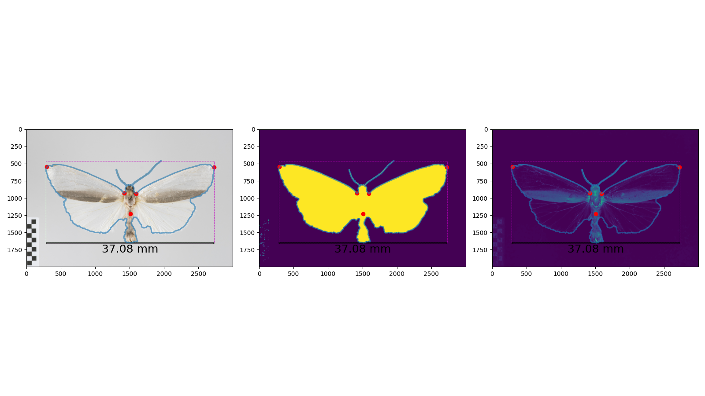

# MothSegmentation
Moth segmentation pipeline based on https://github.com/erodner/mothseg and https://github.com/machine-shop/mothra.


## Installation
*tested on python 3.9*
```bash
python -m pip install -r requirements.txt
```

## Usage
```bash
./main.py <image_folder> config.yml -y
```

## Examples
| Example 1 | Example 2  |
|---|---|
|  |  |
