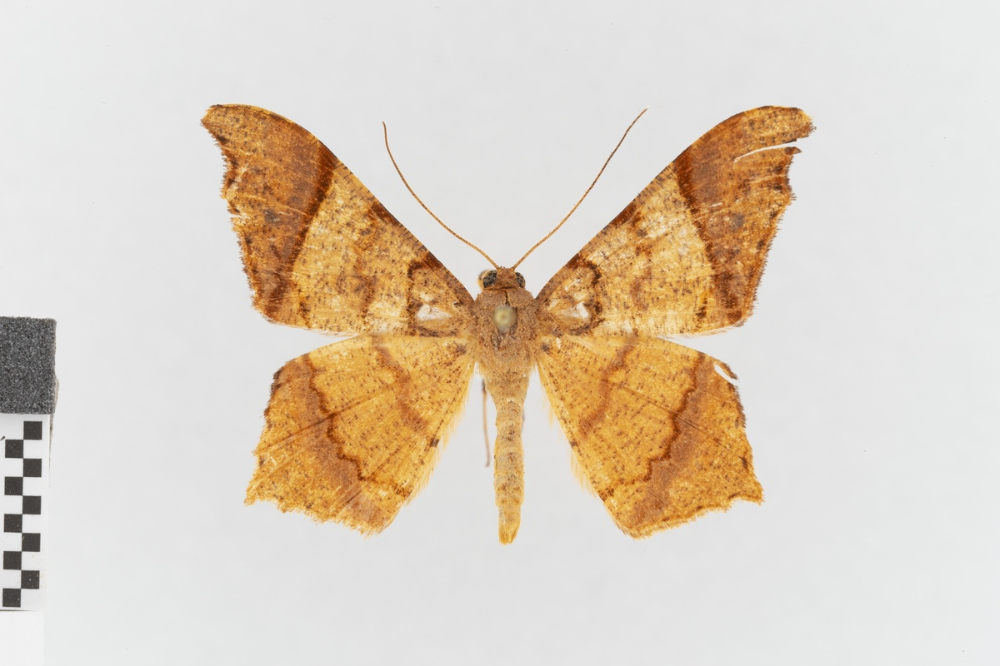
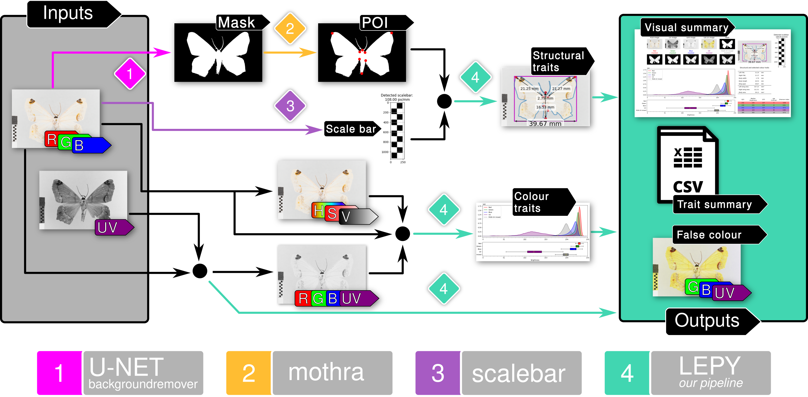
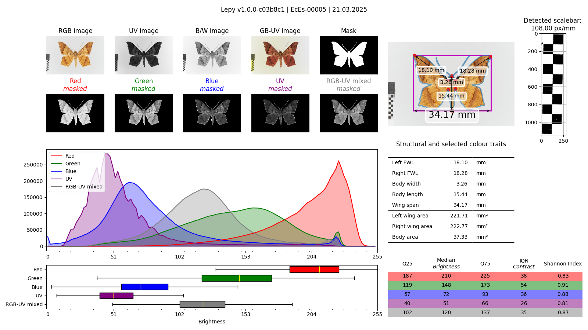
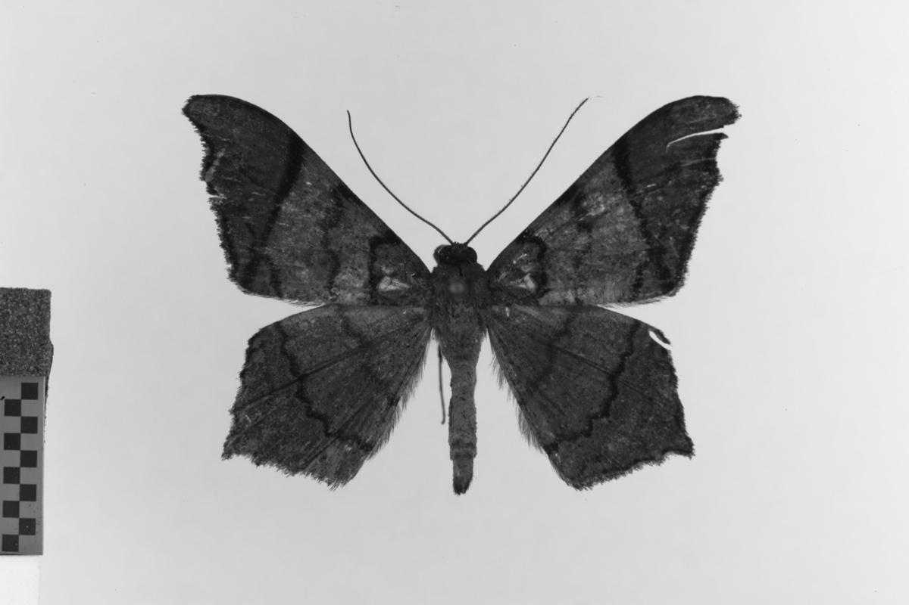
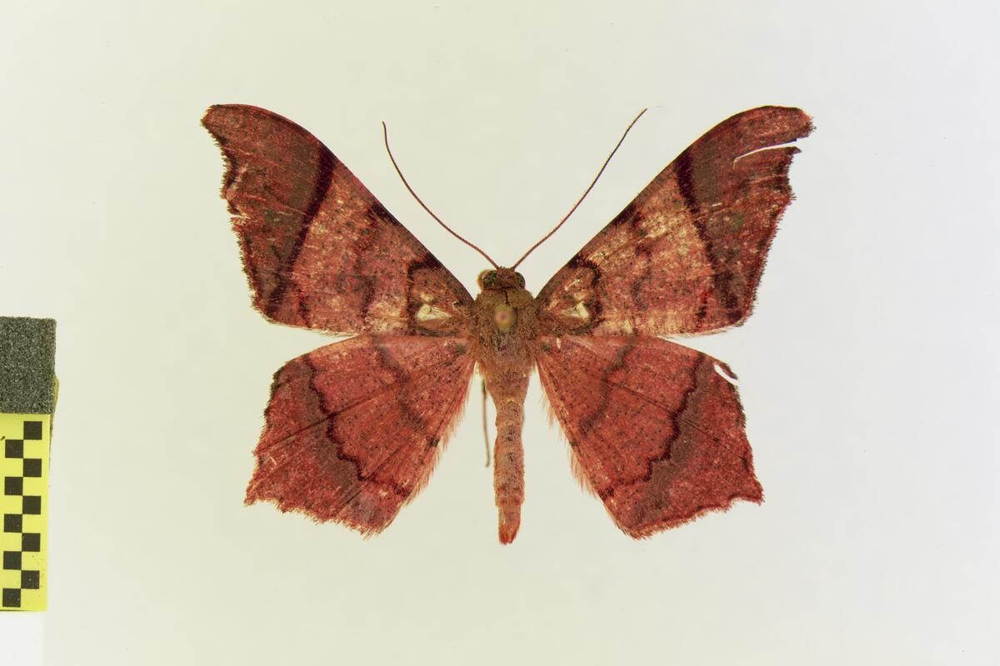

# LEPY
This is an image analysis pipeline for extraction of color and structural traits from moth images. The pipeline is designed to work with images of moths that are placed on a white background. Additionally, structural traits such as wing span, body length, and wing areas are estimated using a scale bar in the image.



## Pipeline
The main steps of the pipeline are:
1. Image segmentation using a pre-trained [U-Net model](https://github.com/nadermx/backgroundremover) created and trained by [nadermx](https://github.com/nadermx/).
2. Localization of eight points of interest (POIs) based on the segmentation mask using the [mothra](https://github.com/machine-shop/mothra) package. We further extended the algorithm used by mothra, which only estimates four POIs (two wing tips and the bases of both forewings), to estimate additional four POIs (two lower points connecting the wings to the body, and the upper and lower tips of the body).
3. Detection of the scale bar in the image using the [scalebar](https://github.com/DiKorsch/scalebar) package.
4. Estimation of the structural and coloring traits of the moth based on the POIs, the segmentation mask, and the scale bar.

Below is the visualizations of the main steps of the pipeline.



### Color traits
A unique feature of our pipeline is the support for an additional color channel, which is highly important in the world of moths: the UV channel. Besides the standard RGB color space, we also convert the images into the HSV color space and calculate a variety of channel-wise statistics (min, max, median, std. dev., Q25, Q75, IQR, etc.). Furthermore, in our visualization, we compute the histograms for the four main channels (R, G, B, and UV).
### Structural traits
Based on the POIs, we estimate the following structural traits:
- Wing span
- Forewing length
- Area of both wings
- Body length, width and area

### Pipeline outputs
#### Visualization
The pipeline outputs a visualization for each input image, which includes the original image, the segmentation mask, the POIs, and the estimated structural and color traits.


#### Trait database
All the extracted traits are saved in a CSV file, which can be used for further analysis. For each image, a row is created in the CSV file, which includes the extracted traits and different other metadata.

#### GB-UV image
The pipeline also creates a new image, which combines the UV channel with Green and Blue channels of the original image. An example of such an image is shown below.

| Input image | UV channel  | GB-UV image  |
|:-:|:-:|:-:|
|  |  |  |

## Installation
*tested on python>=3.9*

We recommend using a virtual environment (either with [`venv`](https://docs.python.org/3/library/venv.html) or with [`conda`](https://www.anaconda.com/docs/getting-started/miniconda/install)) to install the required packages (listed in `requirements.txt`).
```bash
pip install -r requirements.txt
```

If you encounter any issues with the versions with the installed packages, please retry the installation with the exact requirements listed in the `requirements_exact.txt` file:
```bash
pip install -r requirements_exact.txt
```


## Usage
The pipeline can be run using the following command:
```bash
./main.py <image_folder> config.yml
```

The pipeline requires two arguments:
1. `image_folder`: The path to the folder containing the images to be analyzed.
2. `config.yml`: The path to the configuration file, which defines important parameters for the pipeline. We provide an example configuration file in the root of this repository.

For more information about the command line arguments, you can run:
```bash
./main.py --help
```
